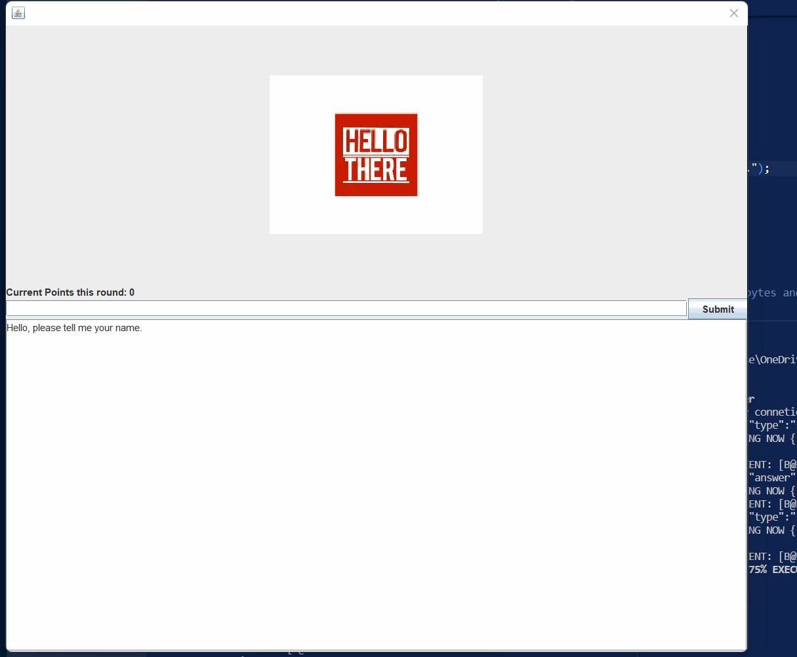

##Demo

This is a java program that uses gradle and java language. The server and client communicate with each other 
through a TCP connection and a JSON protocol.

When the clients starts up it should connect to the server. The server will reply by asking for the name of the player.

When the game starts, the server will send a picture from a country/city which gets serialized and then displayed by the client.
Then client (user) will need to try to guess which country or city it is. The server has four images for each country/city and 
if the client cannot guess the first they can ask for another. Client wins if they get 12 or more points and loses if they have -3 points. 
When the game is over the server asks if the user wants to continue.

The client should send their name and the server should receive it and greet the client by name.The client should be presented a choice
between seeing a leader board or playing the game 

The leader board will show all players that have played since the server started with their name and points. 
The server will maintain the leader board and send it to the client when requested.The leader board 
is persistent even when the server is restarted.

The client can then either enter a guess, e.g. "Ireland", type "more" or "next".

The client enters a guess and the server must check the guess and respond accordingly. If the answer is correct then they will get a new
image with a new country/city or they might win. If the answer is incorrect they will be informed that the answer was incorrect and can try
again.

If the client enters "more" then they will get another image from the same country/city. If they enter "more" when the last image was already
displayed for this country/city then they need to be informed that there are no more pictures.
Users can always enter "next" which will make the server send a new image for a new country/city. 
